# rdocker 🐍🥷🌶️
rdocker : Dev Container | VS Code, Docker, Python, Node.js, Jinja |

## Objectives
- Creat standard environment for developers in agency who work on the Python Products Dashboard. 
- Any developer can immediately open, run, and work on the project.
- Learn how & why you would use a container as a development environment.
- Install Dev Containers extension in Visual Studio Code & used its commands (adding container configuration files, reopening app in container & rebuilding container after making - changes).
- Explore the files that make up container configuration.
- Customized container & development experience by forwarding ports, changing settings, and installing additional software.

## Remote Development with Visual Studio Code (Dev Container)

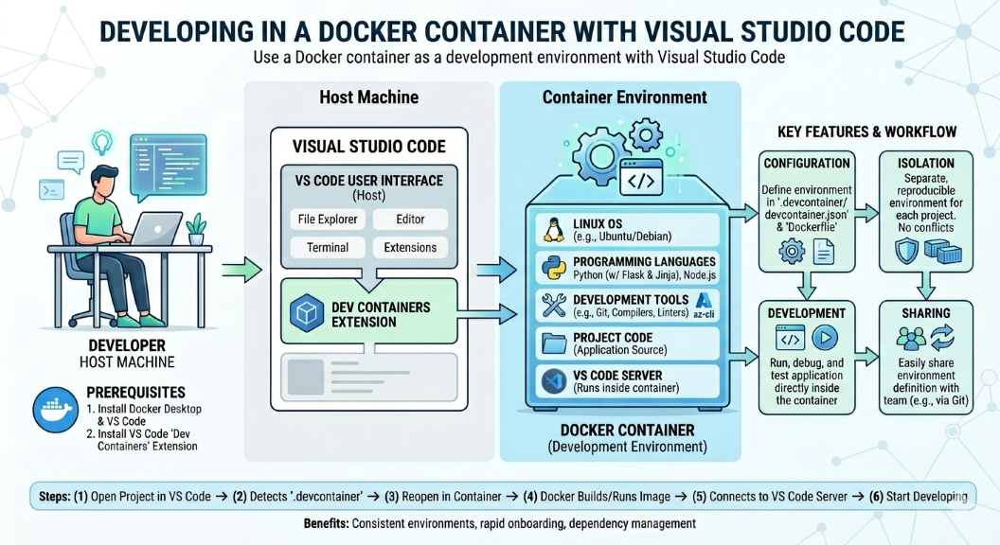

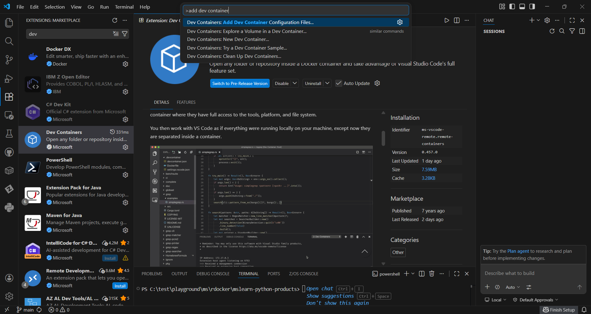

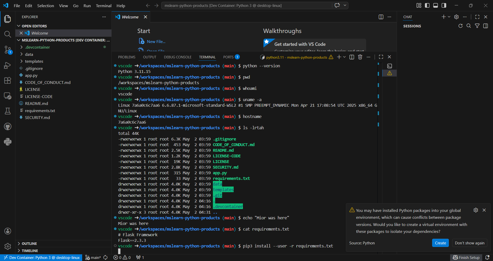

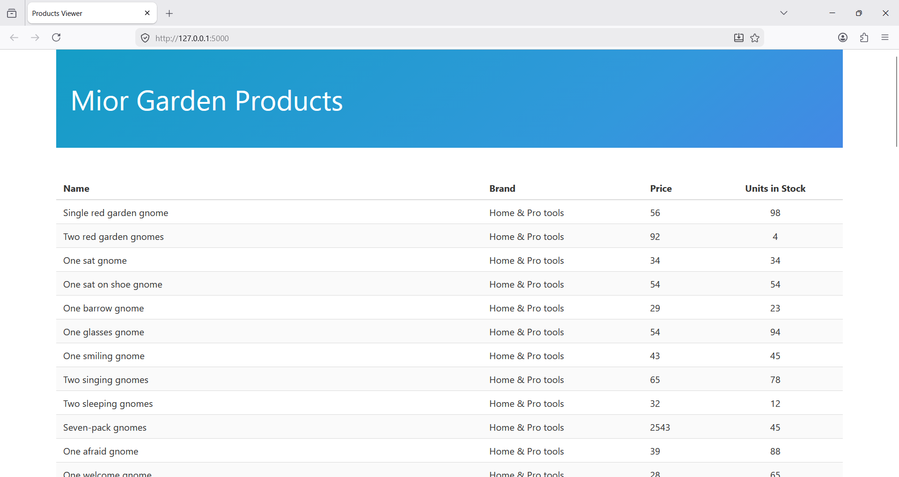

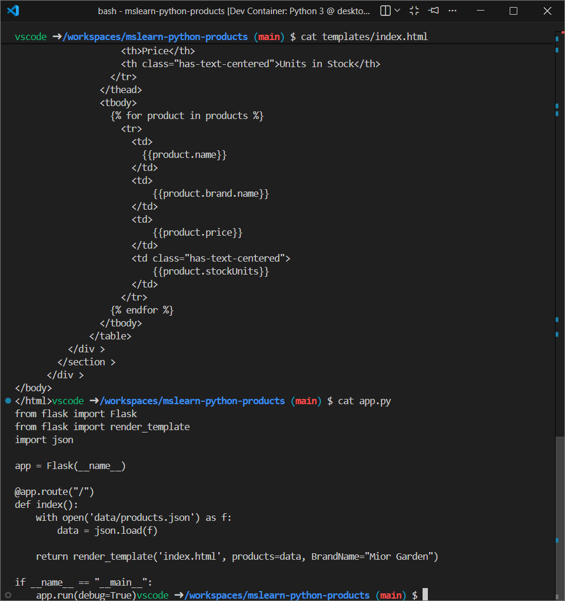

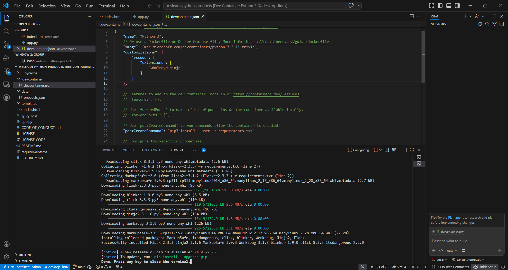

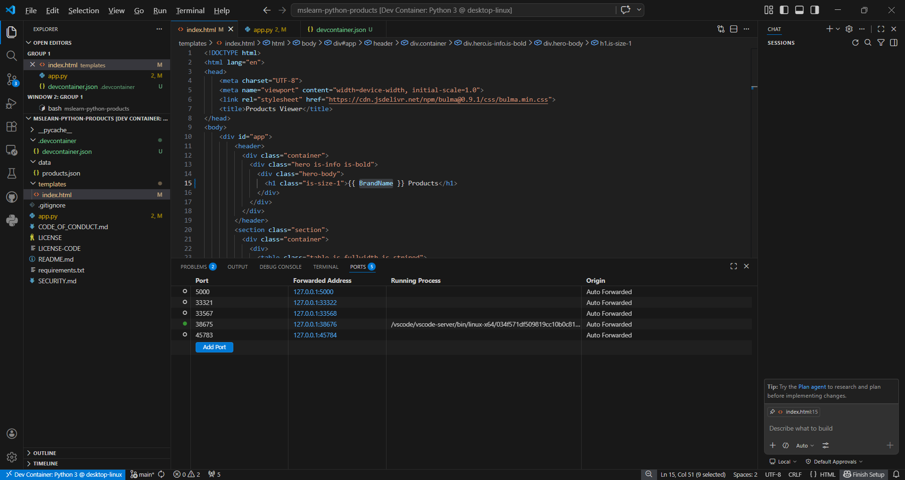

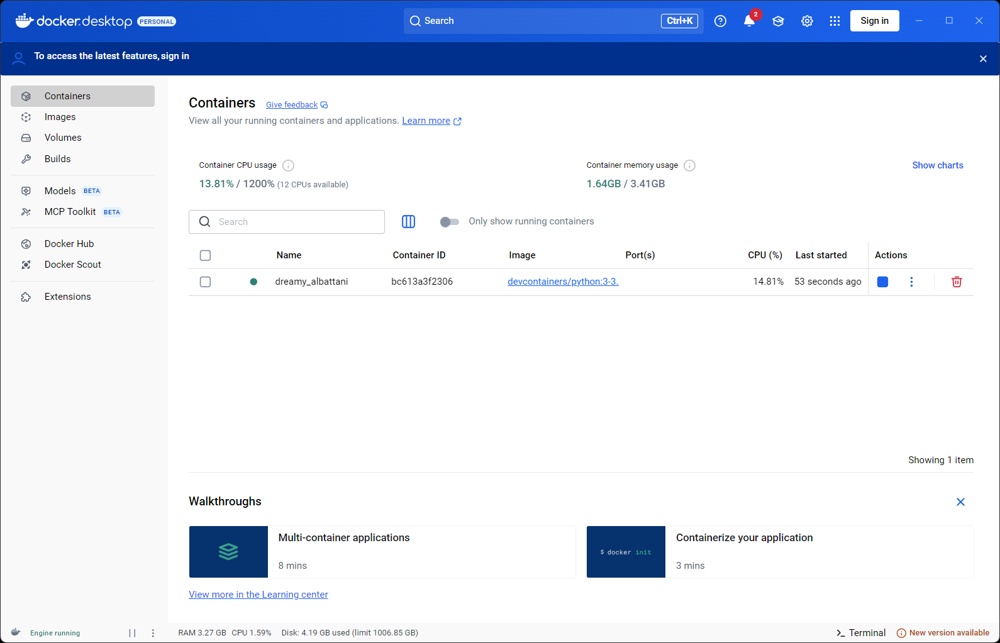

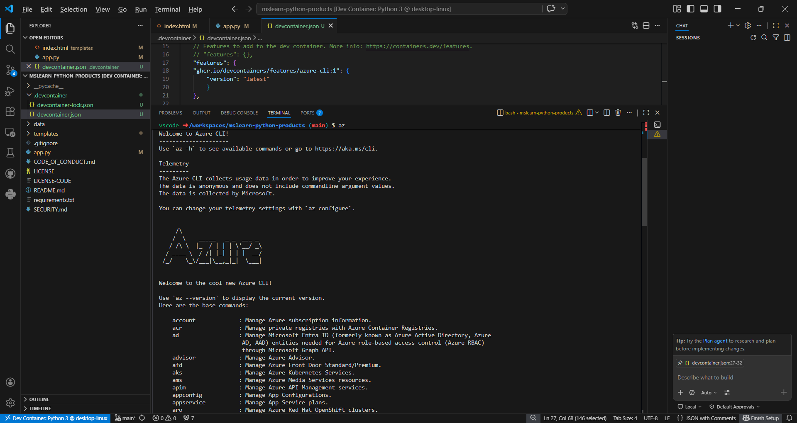

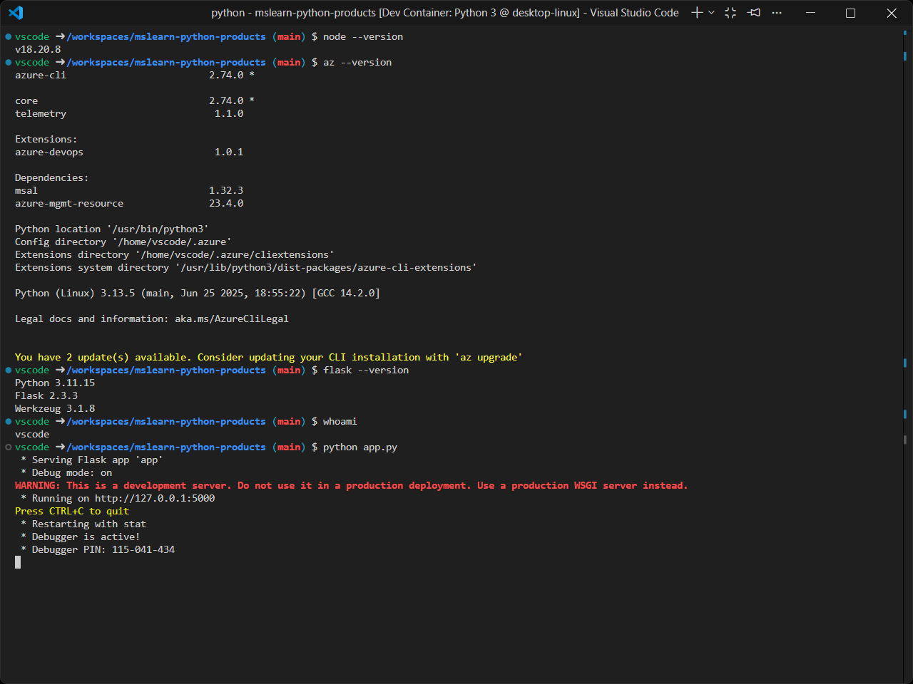

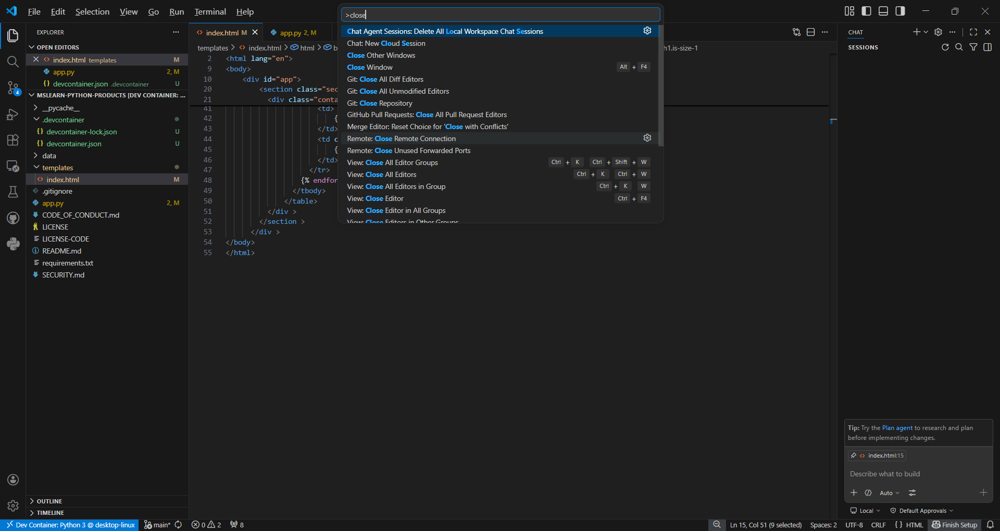

